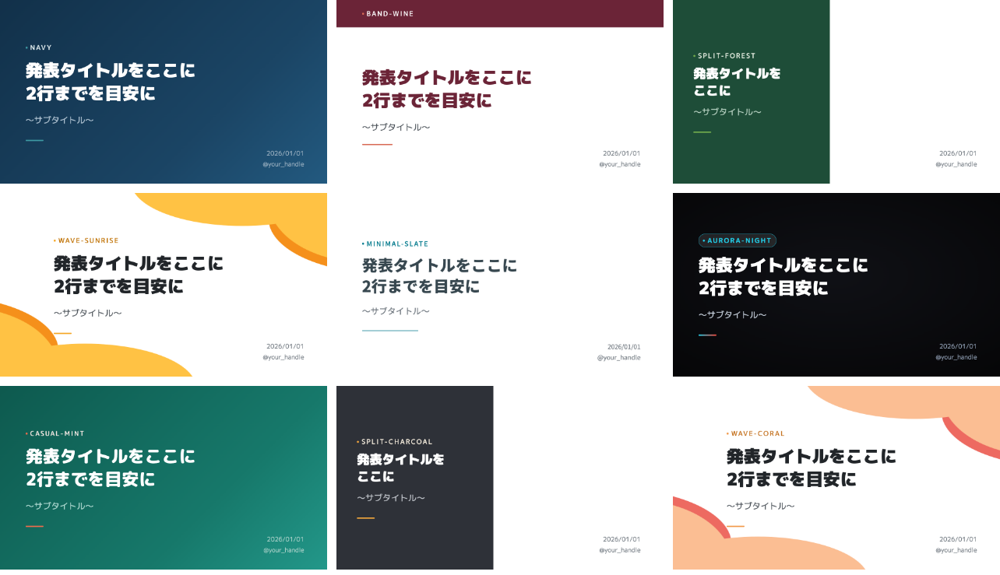
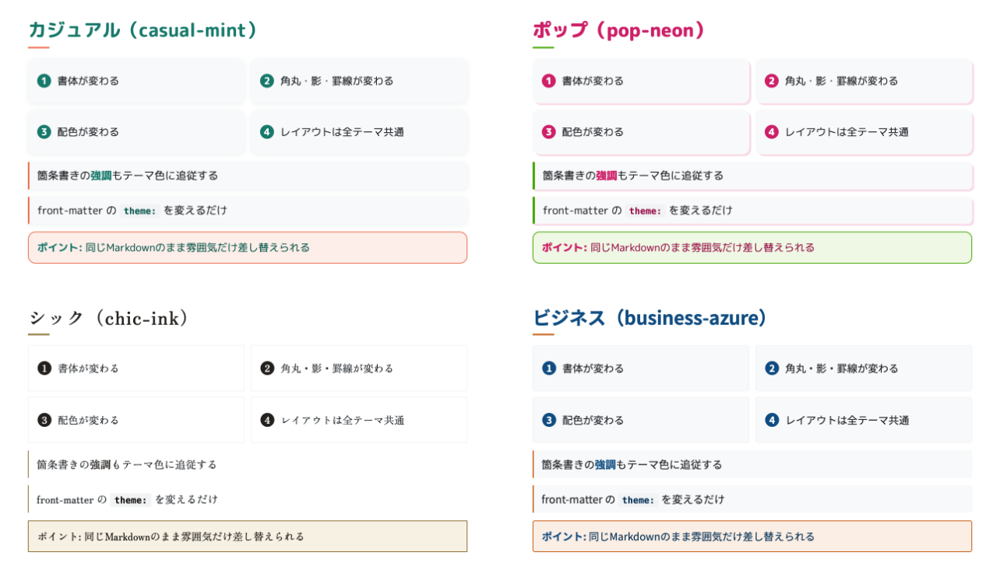
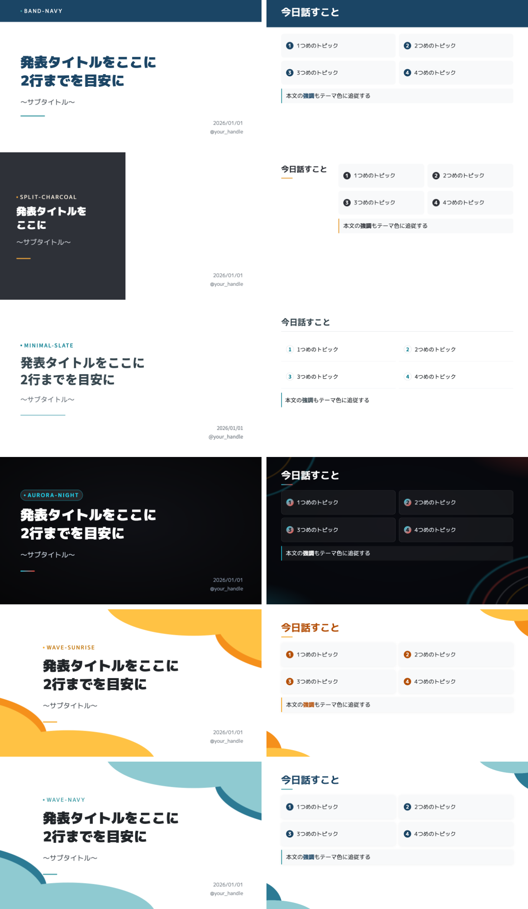
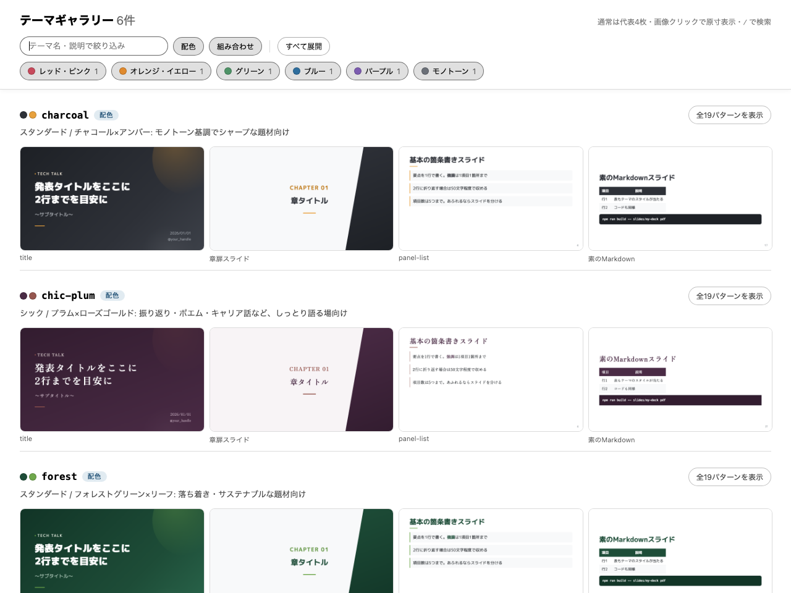
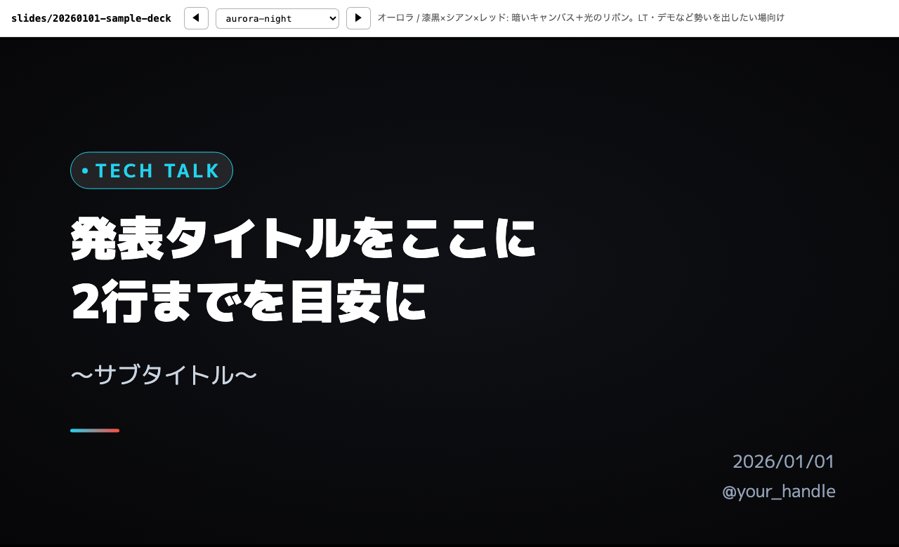
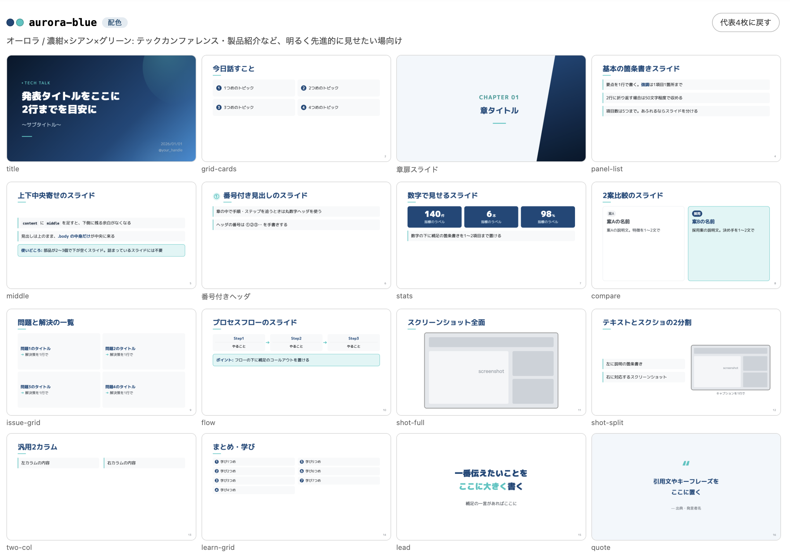
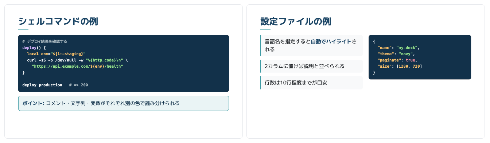
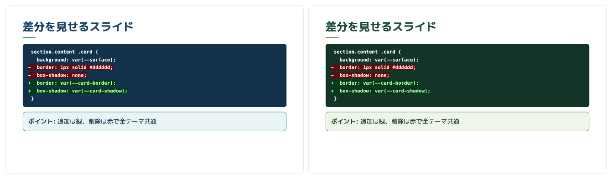

# 🎨 marp-slides-studio

[](https://marp.app/)
[](https://nodejs.org/)
[](#ビルド)<br>


[Marp](https://marp.app/) でLT・発表スライドを作るためのスライド制作環境です。AIエージェントにスライド作成を依頼するワークフローを同梱しています（Claude Code はスキル・hook までフル対応、他エージェントは [AGENTS.md](AGENTS.md) 経由）。

Markdownを書くだけで、配色とレイアウトが揃ったスライドができます。1デッキ=1ディレクトリで管理し、共通テーマ（テーマ50種＋レイアウトパターン集）を使い回します。



## 使い始める

このリポジトリは**テンプレートリポジトリ**です。GitHub の「Use this template」から自分のリポジトリを作るのが手軽です（fork でも clone でも構いません）。

```bash
gh repo create my-slides --template unsolublesugar/marp-slides-studio --private --clone
cd my-slides
npm install
npm run new -- 20260101-my-first-talk
```

`slides/20260101-sample-deck/` に全レイアウト入りの見本デッキが入っています。不要になったら削除してください。

> [!IMPORTANT]
> このリポジトリの `.gitignore` は、私物スライドの誤コミットを防ぐため**見本デッキ以外の `slides/` を無視**しています。自分のリポジトリでデッキを管理するには、`.gitignore` の `slides/*` と `!slides/20260101-sample-deck/` の2行を削除してください。

## 特徴

- **テーマ50種** — front-matter の `theme:` を1行変えるだけで、配色・雰囲気（トーン）・組み方（レイアウト）が切り替わる。Markdownは書き換えなくてよい（`base` は `navy` のエイリアスなので、`theme:` に書ける名前は51個）
- **レイアウトパターン集** — 表紙・章扉・カード・数値・比較・フロー・スクショなど、崩れない組み方を `themes/base.css` に用意
- **1デッキ=1ディレクトリ** — `slides/<YYYYMMDD>-<slug>/` に Markdown・画像・生成物をまとめる
- **雛形からすぐ書ける** — `npm run new` で全レイアウト入りのカタログがコピーされる。不要なスライドを削って書き換えるだけ
- **4形式に書き出し** — HTML / PDF / PPTX / PNG（PNGはレイアウト検証用）
- **ライブプレビュー** — `npm run preview` とVS Code拡張の両方に対応
- **テーマの確認が1コマンド** — `npm run gallery` で全テーマの実物を並べたHTMLを生成、`npm run theme-check` で配色のコントラストを機械的に検査
- **Claude Code Skills同梱** — スライドの作成・視覚検証・テーマ管理・README用スクショ生成のワークフローをスキルとして定義済み

## セットアップ

```bash
npm install
```

PDF / PPTX / PNG 出力にはローカルの Chrome / Chromium が必要です。

## 使い方

### 新しいスライドを作る

```bash
npm run new -- 20260801-my-talk
```

`slides/20260801-my-talk/slides.md` が全レイアウト入りの雛形として作成されます。

### テーマを選ぶ

front-matter の `theme:` を変えるだけで切り替わります。テーマは**トーン**（書体・角丸・影＝場の雰囲気）と**カラー**の組み合わせで、名前は `<トーン>-<カラー>` です。

```markdown
---
marp: true
theme: casual-mint
paginate: true
size: 16:9
html: true
---
```

#### スタンダード — 直線的な角ゴシック。技術・ビジネス全般の標準

| テーマ | 配色 | 向いている題材 |
| --- | --- | --- |
| `base` / `navy` | ネイビー×ティール | 技術・ビジネス全般（デフォルト） |
| `wine` | ワインレッド×コーラル | エモーショナル・クリエイティブ |
| `forest` | グリーン×リーフ | 落ち着き・サステナブル |
| `charcoal` | チャコール×アンバー | モノトーン・シャープ |
| `sunrise` | オレンジ×アンバー | 明るく前向き・LT・社内共有 |
| `coral` | コーラル×ピーチ | やわらかい暖色・ふりかえり・共有会 |

#### トーン付き — 場の空気に合わせて選ぶ



| トーン | 書体・形 | テーマ | 配色 | 向いている場 |
| --- | --- | --- | --- | --- |
| カジュアル | 丸ゴシック／大きめ角丸／やわらかい影 | `casual-mint` | ミント×コーラル | 社内LT・勉強会・もくもく会 |
| | | `casual-berry` | ラズベリー×ミント | 趣味・コミュニティ・LT大会 |
| | | `casual-sky` | スカイブルー×レモン | 屋外イベント・ワークショップ |
| ポップ | 極太丸ゴシック／ハードシャドウ／ビビッド | `pop-neon` | ホットピンク×ライム | イベント・アイスブレイク・宣伝 |
| | | `pop-soda` | ソーダブルー×オレンジ | ハンズオン・入門解説 |
| シック | 明朝／角丸ほぼゼロ／字間広め | `chic-ink` | 墨×シャンパンゴールド | 対談・基調講演 |
| | | `chic-plum` | プラム×ローズゴールド | 振り返り・キャリア話 |
| ビジネス | 角ゴシック／角丸小さめ／ヘアライン | `business-azure` | コーポレートブルー×オレンジ | 提案・報告・社外プレゼン |
| | | `business-slate` | スレートグレー×ティール | 技術説明・設計レビュー |
| パステル | 淡色の面／ヘアライン／**表紙も淡色** | `pastel-sky` | ペールブルー×コーラル | 明るく軽やかに見せたいとき |
| | | `pastel-cream` | クリーム×テラコッタ | 生成りの紙のような暖色 |
| | | `pastel-sage` | セージグリーン×プラム | ふりかえり・共有会 |

トーンが変えるのは**書体・角丸・影・罫線・装飾の濃さ**だけで、余白やグリッドなどのレイアウトは全テーマ共通です。同じMarkdownのまま `theme:` だけ差し替えられます。

### レイアウトを変える

配色やトーンではなく**組み方そのもの**を変えたいときは、レイアウトバリエーションを選びます。こちらもMarkdownは同じままです。



| レイアウト | 組み方 | テーマ | 向いている場 |
| --- | --- | --- | --- |
| バンド | 見出しを全幅のカラーバンドに。表紙は上に帯、締めは下に帯 | `band-<カラー>`（スタンダード6配色） | 情報量が多く、章立てをはっきり見せたいとき |
| | | `band-pop-soda` | 同上（極太丸ゴシックで勢いを出す） |
| スプリット | 縦2分割。表紙・章扉・締めは左に色面、本文は左に見出し／右に内容 | `split-<カラー>`（スタンダード6配色） | 見出しと内容を対比させたいとき |
| | | `split-chic-ink` | 同上（明朝で落ち着かせる） |
| ミニマル | 濃色の面と装飾を全部外し、細い罫線と余白だけで構成 | `minimal-<カラー>`（スタンダード6配色） | 資料として読ませたいとき |
| | | `minimal-slate` | 同上（ビジネストーンのスレートグレー） |
| | | `minimal-ink` | 同上（明朝でエディトリアルに） |
| オーロラ | 全スライドを濃色キャンバスにし、四隅に沿って光の弧を敷く | `aurora-cloud` | 濃紺×シアン×グリーン。テック系イベント・製品紹介 |
| | | `aurora-night` | 漆黒×シアン×レッド。LT・デモで勢いを出したいとき |
| ウェーブ | 白地に、右上と左下から色面が流れ込む | `wave-<カラー>`（スタンダード6配色） | 明るい場・カジュアルな場に。配色で温度感を選ぶ |

`<カラー>` にはスタンダードの6配色（`navy` / `wine` / `forest` / `charcoal` / `sunrise` / `coral`）がそのまま入ります（例: `band-wine`、`split-navy`、`minimal-coral`、`wave-forest`）。オーロラだけは暗いキャンバス用の専用配色（`--canvas-bg` / `--ribbon-*`）が必要なため、`aurora-cloud` / `aurora-night` の2種です。

> [!NOTE]
> `split` は表紙タイトルが左半分に入るため、**20文字程度までの短いタイトル**を前提にしています。長い場合は `band` か標準レイアウトを選んでください。
>
> `aurora` は文字・カード・罫線をまとめて暗背景向けに反転します。弧を敷くのは本文（`content`）と引用（`quote`）だけで、表紙・章扉・`lead`・締めは地のグラデーションのみです。配色を持つ `aurora-blue` / `aurora-neon` は単体でも使えますが、その場合は通常の明るいキャンバスになります。
>
> `wave` は表紙・章扉・締めに大きな面、本文には角に小さな面だけを置きます。配色テーマは単体でも使え、その場合は標準レイアウト（濃色の表紙）のテーマになります。

### テーマを確認する

テーマが増えてきたので、実物を並べて見比べられるようにしてあります。

```bash
npm run gallery                        # 全テーマ（生成後にブラウザで開く）
npm run gallery -- sunrise wave-coral  # テーマを絞る
npm run gallery -- --no-open           # 開かずにパスだけ出す
```



テーマごとに `template/slides.md` の全レイアウトパターンをPNG化し、一覧HTMLを `.gallery/` に生成します。通常は代表4枚（表紙 / 章扉 / 箇条書き / コード）だけを表示し、テーマ単位・一括で全パターンに展開できます。名前や説明での絞り込み、配色／組み合わせの切り替えに加え、**色系統チップ**（レッド系・ブルー系・モノトーンなど、テーマの実色から自動分類）でワンクリック絞り込みができます（ダブルクリックでその系統だけ表示）。テーマ名の横には主要色・アクセント色の色見本が付き、画像はクリックで原寸表示です。

書きかけのデッキを実際のテーマで着せ替えながら見たいときは、テーマ切替プレビューを使います。デッキをテーマごとにHTML化し、セレクタ（`[` / `]` キーでも可）で**その場で着せ替えながら**確認できるページを `<deck>/.theme-preview/` に生成します。Chromeは不要です。



```bash
npm run theme-preview -- slides/20260801-my-talk            # 全テーマ（生成後にブラウザで開く）
npm run theme-preview -- slides/20260801-my-talk wine coral # テーマを絞る
npm run theme-preview -- slides/20260801-my-talk --no-open  # 開かずにパスだけ出す
```

配色は目視だけだと弱点を見落とすので、コントラスト比の検査も用意しています。本文4.5:1 / 大きい文字3:1 / コードパネル6:1 を下限に、閾値を割る組み合わせがあれば終了コード1で一覧表示します。あわせて `.vscode/settings.json` へのテーマ登録漏れ（`layout-*` レイヤー含む）も検出します。

```bash
npm run theme-check              # 全テーマ
npm run theme-check -- sunrise   # テーマを絞る
```

閾値を割っている場合の出力例:

```text
閾値を割る組み合わせ: 2件

 1.66 (要3)  aurora-neon      章番号
 1.96 (要3)  aurora-blue      章番号
```

### ビルド

```bash
npm run build -- slides/20260801-my-talk        # HTML
npm run build -- slides/20260801-my-talk pdf    # PDF
npm run build -- slides/20260801-my-talk pptx   # PowerPoint
npm run build -- slides/20260801-my-talk png    # スライド毎のPNG（検証用）
npm run preview                                 # ライブプレビュー（http://localhost:8080）
```

生成物は各デッキのディレクトリ内に出力されます。VS Code + [Marp for VS Code](https://marketplace.visualstudio.com/items?itemName=marp-team.marp-vscode) でもプレビュー可能です（テーマは `.vscode/settings.json` で登録済み）。

## レイアウトパターン



`template/slides.md` がそのままカタログになっています。主なもの:

| クラス / 部品 | 用途 |
| --- | --- |
| `title` / `section` / `closing` | 表紙・章扉・締め（グラデーション背景） |
| `panel-list` | 基本の箇条書き（3〜5項目） |
| `grid-cards` | アジェンダ・要素の列挙（2〜4項目） |
| `stats` | 数値実績を3つ横並び |
| `compare` | 2案比較（採用側をハイライト） |
| `issue-grid` | 問題→解決の2×2 |
| `flow` | 横方向のプロセス（3〜5ステップ） |
| `shot-full` / `shot-split` | スクリーンショット1枚／左テキスト＋右スクショ |
| `two-col` / `callout` / `learn-grid` | 汎用2カラム／補足／まとめの番号付きリスト |
| `lead` / `quote` | 大きなメッセージ・引用 |
| （クラスなし） | 素のMarkdown（表・[コードブロック](#コードブロック)もテーマ済み） |

詳細は [.claude/skills/marp-deck/patterns.md](.claude/skills/marp-deck/patterns.md) を参照。

## コードブロック

言語名付きのコードフェンスを書くだけで、濃色パネル＋シンタックスハイライトになります。`.body` の中にそのまま置けるほか、`two-col` で説明と並べたり、`callout` と組み合わせたりできます。



````markdown
<!-- _class: content -->

<div class="head"><h1 class="bare">シェルコマンドの例</h1></div>
<div class="body">

```bash
deploy production   # => 200
```

</div>
````

> [!NOTE]
> `<div>` とコードフェンスの間には**空行が必要**です。空行がないとMarkdownとして解釈されず、コードブロックになりません。

### ハイライトの配色

Marp既定のハイライト色はGitHubの明背景向けなので、そのままでは文字列リテラルなどが濃色パネルに埋もれます。本テーマでは背景と色相がぶつからないよう寒色を避けた配色を `themes/base.css` に定義しています。

| トークン | CSS変数 | 色 | 用途 |
| --- | --- | --- | --- |
| 文字列 | `--code-string` | `#98E58C` | 文字列リテラル |
| キーワード | `--code-keyword` | `#FF8FA3` | 予約語・組み込み |
| 数値・定数 | `--code-number` | `#FFC46B` | 数値・変数展開 |
| 関数名・型 | `--code-entity` | `#D8B4FE` | 関数名・型名 |
| コメント | `--code-comment` | `#B0BEC5` | コメント |

いずれも**全テーマのパネル地色に対して6:1以上**のコントラストがあります。パネルの地色は `--code-bg`（既定は `--primary-dark`）で、`pop-neon` のように `--primary-dark` 自体が明るいテーマだけ、6:1を保てる暗色をテーマ側で個別に指定しています。

### 行の長さと自動縮小

コードブロックはMarp既定テーマの自動縮小が効くため、**はみ出しても切れず、横スクロールもしません**。代わりにブロック単位で文字が小さくなります。縮小はブロックごとに独立して効くので、1行だけ長いコードがあるとそのブロック全体が小さくなります。

| 1行の長さ | 見え方 |
| --- | --- |
| 〜80文字 | 縮小なし。会場の後方からでも読める |
| 80〜100文字 | わずかに縮小。実用範囲 |
| 100文字〜 | 縮小が目立つ。160文字ではほぼ判読不能 |

長いコマンドは `\` で折り返して1行を短く保ってください。

### 書くときの目安

- 行数は**10行程度まで**。あふれる場合はスライドを分ける
- 説明を添えるなら `two-col`（左に箇条書き・右にコード）か、下に `callout` を置く
- 言語名を省略するとハイライトなしの単色になる

### 差分を見せる

` ```diff ` で差分を表示できます。追加行は薄緑、削除行は薄ピンクの文字になります。



diffの配色だけは**全テーマ共通**です。`--code-*` とは別系統で、Marp既定のダークモード配色をそのまま使うため、テーマを変えても追加＝緑・削除＝赤の対応は変わりません（上の例の左が `navy`、右が `forest`）。

> [!NOTE]
> 追加・削除行の**地色**はGitHubのダークモード同様に控えめです（パネルとの輝度差は1.1程度）。`forest` では緑の追加行が、`wine` では赤の削除行がパネルに溶けます。行の区別は文字色と行頭の `+` / `-` が担うため、地色の濃淡には頼らない前提で書いてください。

## ディレクトリ構成

```text
├── themes/           # 共通テーマ（base = レイアウトの実体 + 各テーマ）
│   ├── base.css      #   レイアウトパターン + カラー/トーントークンの定義
│   ├── navy|wine|forest|charcoal|sunrise|coral.css  # カラーのみ上書き（スタンダード）
│   ├── casual-*|pop-*|chic-*|business-*|pastel-*.css  # トーン + カラーを上書き
│   ├── aurora-{blue,neon}.css               # 暗いキャンバス用カラー（--canvas-bg / --ribbon-*）
│   ├── layout-{band,split,minimal,aurora,wave}.css  # 組み方を差し替えるレイヤー（単体では使わない）
│   └── band-*|split-*|minimal-*|aurora-*|wave-*.css  # カラーテーマ + レイアウトレイヤーの組み合わせ
├── template/         # 新規デッキの雛形（全レイアウトのカタログ）
├── slides/           # 各スライドデッキ
│   └── 20260101-sample-deck/  # 見本デッキ（slides.md + assets/ + 生成物）
├── scripts/          # new-deck.sh / build.sh / list-themes.mjs / docs-shot.mjs / theme-gallery.mjs / theme-check.mjs
├── docs/             # README用のスクリーンショット（docs-shot.mjs で生成）
├── .steering/        # Claude Code向けの設計知識（アーキテクチャ / Marp制約 / トラブルシューティング）
└── .claude/
    ├── rules/        # 運用規範（テーマCSS / Git運用）
    ├── hooks/        # PostToolUse hook（テーマ変更の波及先チェック）
    └── skills/       # ワークフロー
        ├── marp-deck/    #   作成・編集（パターンカタログ / スタイルルール）
        ├── marp-check/   #   PNG書き出しによる視覚検証
        ├── marp-theme/   #   テーマの追加・変更・確認
        └── marp-shots/   #   README用スクショの生成
```

## Claude Codeでの利用

このリポジトリには以下のスキルが入っています。

| スキル | 発火する言い方 | やること |
| --- | --- | --- |
| `marp-deck` | 「スライドを作って」「LT資料を作りたい」 | 雛形作成 → テーマ選択 → パターン選択 → スタイルルール適用 |
| `marp-check` | 「スライドを確認して」「崩れがないか見て」 | PNG書き出し → 1枚ずつ目視検証 → 修正 |
| `marp-theme` | 「テーマを追加して」「配色を変えたい」 | [コントラスト検査](#テーマを確認する) → ギャラリーで実物確認 → 登録先の更新 |
| `marp-shots` | 「READMEの画像を更新して」 | [見本スクショ](#readme用のスクリーンショット)の再生成 → 目視確認 |

テーマを追加・変更すると PostToolUse hook（`.claude/hooks/theme-changed.sh`）が検査コマンドと登録先チェックリスト（marp-theme スキル）への誘導を出すので、登録漏れに気づける。`.vscode/settings.json` への登録漏れは `npm run theme-check` が機械的に検出する。

このほか `.claude/rules/`（運用規範）と `.steering/`（設計知識・Marp固有の制約・過去に踏んだ罠）を CLAUDE.md から参照する構成にしている。

## カスタマイズ

### テーマを追加する

どのテーマも `base` を `@import` して `:root` のCSS変数を上書きするだけの構成です。レイアウトはすべて `base` から継承されるので、テーマ側にセレクタを書く必要はありません。追加後は `.vscode/settings.json` の `markdown.marp.themes` にも登録します（登録漏れは `npm run theme-check` が検出します）。

- **配色だけ変える** — `themes/wine.css` をコピーし、`/* @theme <name> */` とカラー変数を書き換える
- **雰囲気ごと変える** — 近いトーンのファイル（例 `themes/casual-mint.css`）をコピーし、トークンとカラーを書き換える

トーンを決めるトークンは `themes/base.css` の `:root` にまとまっています。

| 種別 | 変数 | 効くもの |
| --- | --- | --- |
| 書体 | `--font-body` / `--font-head` | 本文・見出しのフォント（Webフォントはテーマ側で `@import`） |
| 太さ・字間 | `--weight-head` / `--weight-title` / `--letter-head` / `--letter-title` | 見出しと特大見出し |
| 角丸 | `--radius-lg` `--radius-md` `--radius-sm` `--radius-xs` `--radius-chip` `--radius-pill` `--radius-bar` | カード・コード・タグ・アクセントバー |
| 面 | `--surface` / `--bg-alt` / `--card-shadow` / `--card-border` / `--panel-bar-width` | カードの地色・影・罫線、章扉と引用の全面地色 |
| 間隔 | `--stack-gap` | `.body` 内に部品を縦に積んだときの間隔（既定20px） |
| 装飾 | `--orb-opacity` / `--hero-bg` / `--side-bg` / `--on-accent` | 表紙の光の玉、表紙と締めの背景、章扉の斜めパネル、アクセント上の文字色 |

> [!NOTE]
> 新しいテーマを足したら `--code-bg` の上に [`--code-*`](#ハイライトの配色) が6:1以上あるか確認してください。`--primary-dark` が明るめのテーマは `--code-bg` に暗色を指定します。

### レイアウトを追加・組み合わせる

レイアウトは `themes/layout-*.css` という**重ねるレイヤー**として定義しています。`base` と同じセレクタを後から上書きする作りなので、この5ファイルだけがCSS変数ではなくセレクタを持ちます。

組み合わせは2行で作れます。カラーテーマを先に、レイアウトを後に読み込むのが決まりです。

```css
/* @theme band-forest */
@import "forest";        /* 配色・トーン */
@import "layout-band";   /* 組み方（必ず後） */
```

新しいレイアウトを作るときは `themes/layout-minimal.css` あたりを手本にします。Marp特有の注意が3つあります。

- `section > :first-child` に `margin-top: 0 !important` が当たるため、**先頭要素を負のマージンで全幅にはできない**。`section` の padding を0にして `.head` / `.body` 側に padding を持たせる（`layout-band.css` がこの形）
- ページ番号 `section::after` は `padding: inherit` で位置が決まるので、`section` の padding を変えたら `::after` 側にも余白を指定し直す
- 全面に装飾を敷きたいときは `section` の**背景レイヤー**として重ねる。Marpitが `section::before` を装飾用に押さえているため、疑似要素は描画されない（`layout-aurora.css` がこの形。`filter: blur()` はPDFの印刷経路で失われるので、グラデーションだけで描くのが安全）

追加したら `.vscode/settings.json` の `markdown.marp.themes` に、**レイヤー本体（`layout-*.css`）と組み合わせテーマの両方**を登録します（レイヤーが未登録だとVS Codeのプレビューで `@import` が解決できません。登録漏れは `npm run theme-check` が検出します）。

### レイアウトパターンを追加する

`themes/base.css` にパターンを追加してから使います。あわせて `template/slides.md`（カタログ）と `.claude/skills/marp-deck/patterns.md`（スキルの参照先）にも登録します。

部品どうしの縦の間隔は個々の部品ではなく `.body` 側で一元管理しています（`--stack-gap`）。そのため新しい部品に `margin-bottom` を持たせる必要はありません。ただし**自前で `gap` を持つ横並びレイアウト**（`compare` や `two-col` のような `.body` のレイアウトクラス）を追加したときは、間隔が二重に付かないよう `base.css` の次の `:not()` にクラス名を足してください。

```css
section.content .body:not(.two-col):not(.compare):not(.issue-grid):not(.shot-split):not(.shot-full) > * + * {
  margin-top: var(--stack-gap);
}
```

### README用のスクリーンショット

`docs/*.png` は手で撮らず、`npm run docs-shot` で生成します。見本デッキをMarpでPNG化し、それをグリッドに並べたHTMLをChromeヘッドレスで1枚に撮る仕組みで、追加の依存（ImageMagick等）は要りません。

```bash
npm run docs-shot                      # 全プリセット
npm run docs-shot -- themes layouts    # 指定プリセットだけ
```

| プリセット | 中身 |
| --- | --- |
| `themes` | 全カラーテーマの表紙（3列） |
| `tones` | 各トーンの代表テーマの本文（2列） |
| `layouts` | レイアウトレイヤーごとの代表の表紙＋本文（1行=1レイアウト） |
| `patterns` | 代表的なレイアウトパターン |
| `code-block` / `code-block-diff` | コードブロックとdiffの表示例 |
| `gallery` / `theme-preview` | ギャラリーとテーマ切替プレビューのUI（実際にツールを実行してページを撮る） |

見本の中身（並べるテーマ、パターン、段組、1枚の表示幅）は `scripts/docs-shot.mjs` の `PRESETS` にまとまっています。テーマやパターンを足したら、この配列に追加してから撮り直してください。Chromeが既定のパスにない環境では `CHROME_PATH` を指定します。

### コードの配色を変える

`themes/base.css` の `:root` にある [`--code-*` 変数](#ハイライトの配色)を上書きします。テーマ側のファイルに書けば、そのテーマだけの配色にできます。

```css
:root {
  --code-string: #A8E6A1;
  --code-keyword: #FFA0B4;
  --code-bg: #1A1F2B;   /* パネルの地色（既定は --primary-dark） */
}
```

濃色パネル（`--code-bg`）の上に乗るため、**明度の高い色**を選んでください。背景と同系の寒色や暗い色は埋もれます。変更後は `npm run build -- slides/<deck> png` で書き出して実際の見え方を確認します。

## コントリビュート

バグ報告・テーマの追加・改善提案を歓迎します。開発フローとPR前のチェックは [CONTRIBUTING.md](CONTRIBUTING.md) を参照してください。

## License

[MIT](LICENSE)
